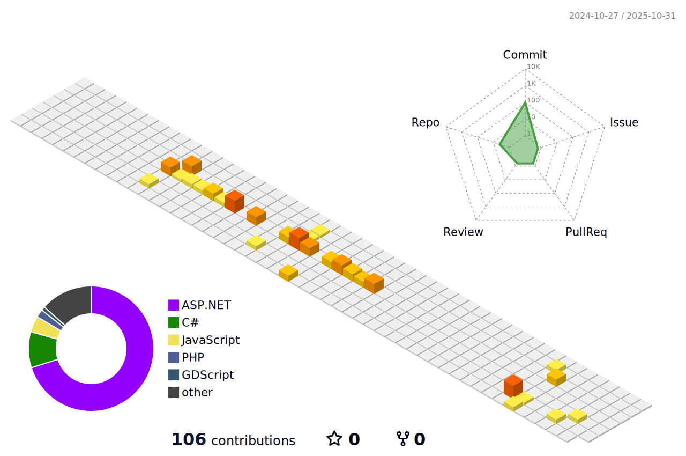

## Hi there 👋

### :hammer_and_wrench: Languages and Tools :

[![js][js-logo]][js-link]
[![html][html-logo]][html-link]
[![css][css-logo]][css-link]
[![c#][c#-logo]][c#-link]
[![c++][c-plus-plus-logo]][c-plus-plus-link]
[![.net][dotnet-logo]][dotnet-link]
[![express][express-logo]][express-link]
[![firebase][firebase-logo]][firebase-link]
[![arduino][arduino-logo]][arduino-link]
[![java][java-logo]][java-link]
[![spring][spring-logo]][spring-link]
[![nodejs][nodejs-logo]][nodejs-link]
[![mysql][mysql-logo]][mysql-link]
[![phpStorm][phpstorm-logo]][phpstorm-link]
[![intellij][intellij-logo]][intellij-link]
[![illustrator][illustrator-logo]][illustrator-link]
[![photoshop][photoshop-logo]][photoshop-link]
[![linux][linux-logo]][linux-link]
[![arch][arch-logo]][arch-link]
[![php][php-logo]][php-link]
[![react][react-logo]][react-link]
[![figma][figma-logo]][figma-link]
[![maven][maven-logo]][maven-link]
[![python][python-logo]][python-link]
[![regex][regex-logo]][regex-link]
[![unity][unity-logo]][unity-link]
[![vscode][vscode-logo]][vscode-link]
[![windows][windows-logo]][windows-link]
[![wordpress][wordpress-logo]][wordpress-link]
[![npm][npm-logo]][npm-link]
[![godot][godot-logo]][godot-link]

<!-- utils -->
[js-logo]: https://skillicons.dev/icons?i=js
[js-link]: https://developer.mozilla.org/en-US/docs/Web/JavaScript

[html-logo]: https://skillicons.dev/icons?i=html
[html-link]: https://developer.mozilla.org/en-US/docs/Web/HTML

[css-logo]: https://skillicons.dev/icons?i=css
[css-link]: https://developer.mozilla.org/en-US/docs/Web/CSS

[c#-logo]: https://skillicons.dev/icons?i=cs
[c#-link]: https://learn.microsoft.com/it-it/dotnet/csharp

[c-plus-plus-logo]: https://skillicons.dev/icons?i=cpp
[c-plus-plus-link]: https://learn.microsoft.com/en-us/cpp/cpp

[dotnet-logo]: https://skillicons.dev/icons?i=dotnet
[dotnet-link]: https://dotnet.microsoft.com/en-us

[express-logo]: https://skillicons.dev/icons?i=express
[express-link]: https://expressjs.com

[firebase-logo]: https://skillicons.dev/icons?i=firebase
[firebase-link]: https://firebase.google.com

[arduino-logo]: https://skillicons.dev/icons?i=arduino
[arduino-link]: https://www.arduino.cc

[java-logo]: https://skillicons.dev/icons?i=java
[java-link]: https://www.java.com

[spring-logo]: https://skillicons.dev/icons?i=spring
[spring-link]: https://spring.io

[nodejs-logo]: https://skillicons.dev/icons?i=nodejs
[nodejs-link]: https://nodejs.org

[mysql-logo]: https://skillicons.dev/icons?i=mysql
[mysql-link]: https://www.mysql.com

[phpstorm-logo]: https://skillicons.dev/icons?i=phpstorm
[phpstorm-link]: https://www.jetbrains.com/phpstorm

[intellij-logo]: https://skillicons.dev/icons?i=idea
[intellij-link]: https://www.jetbrains.com/idea

[illustrator-logo]: https://skillicons.dev/icons?i=ai
[illustrator-link]: https://www.adobe.com/products/illustrator.html

[photoshop-logo]: https://skillicons.dev/icons?i=ps
[photoshop-link]: https://www.adobe.com/products/photoshop.html

[linux-logo]: https://skillicons.dev/icons?i=linux
[linux-link]: https://www.linux.it

[arch-logo]: https://skillicons.dev/icons?i=arch
[arch-link]: https://archlinux.org

[php-logo]: https://skillicons.dev/icons?i=php
[php-link]: https://www.php.net

[react-logo]: https://skillicons.dev/icons?i=react
[react-link]: https://react.dev

[figma-logo]: https://skillicons.dev/icons?i=figma
[figma-link]: https://www.figma.com

[maven-logo]: https://skillicons.dev/icons?i=maven
[maven-link]: https://maven.apache.org

[python-logo]: https://skillicons.dev/icons?i=py
[python-link]: https://www.python.org

[regex-logo]: https://skillicons.dev/icons?i=regex
[regex-link]: https://regexr.com

[unity-logo]: https://skillicons.dev/icons?i=unity
[unity-link]: https://unity.com

[vscode-logo]: https://skillicons.dev/icons?i=vscode
[vscode-link]: https://code.visualstudio.com

[windows-logo]: https://skillicons.dev/icons?i=windows
[windows-link]: https://www.microsoft.com/windows

[wordpress-logo]: https://skillicons.dev/icons?i=wordpress
[wordpress-link]: https://wordpress.com

[npm-logo]: https://skillicons.dev/icons?i=npm
[npm-link]: https://www.npmjs.com

[godot-logo]: https://skillicons.dev/icons?i=godot
[godot-link]: https://godotengine.org/

<!--
**Scr1my/Scr1my** is a ✨ _special_ ✨ repository because its `README.md` (this file) appears on your GitHub profile.

Here are some ideas to get you started:

- 🔭 I’m currently working on ...
- 🌱 I’m currently learning ...
- 👯 I’m looking to collaborate on ...
- 🤔 I’m looking for help with ...
- 💬 Ask me about ...
- 📫 How to reach me: ...
- 😄 Pronouns: ...
- ⚡ Fun fact: ...
-->
